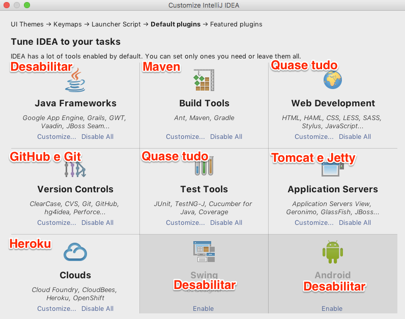
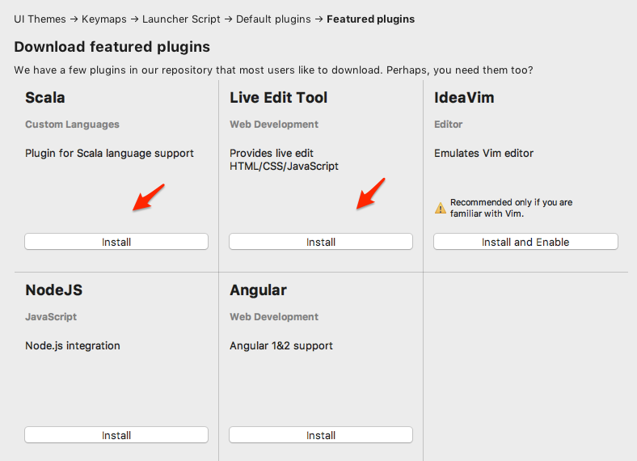
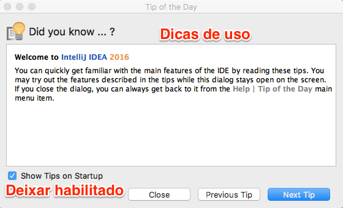
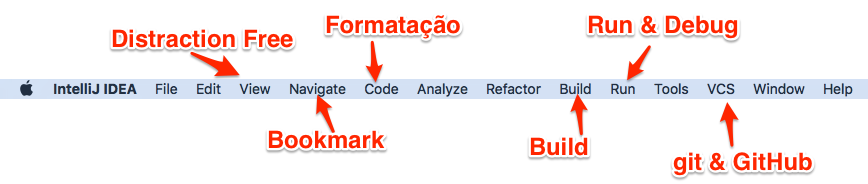
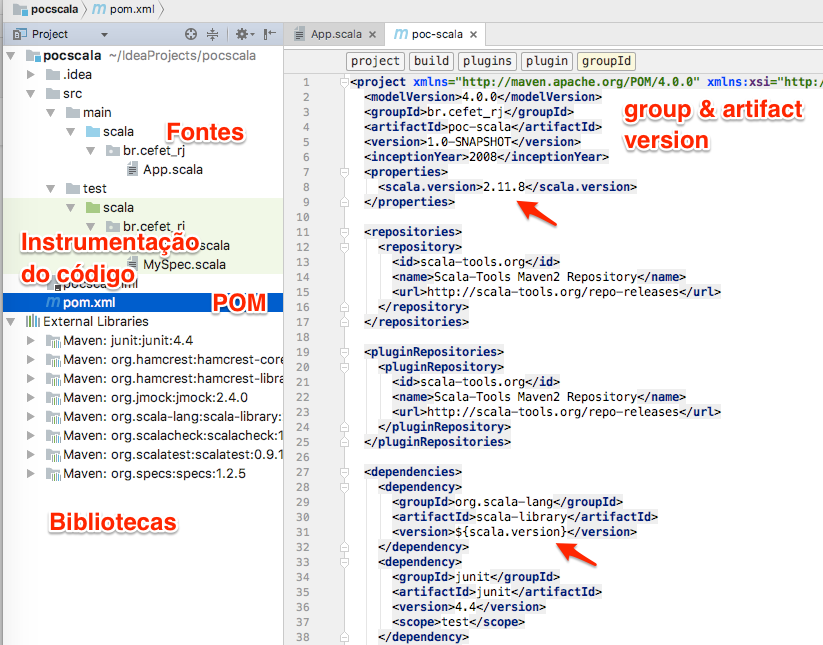
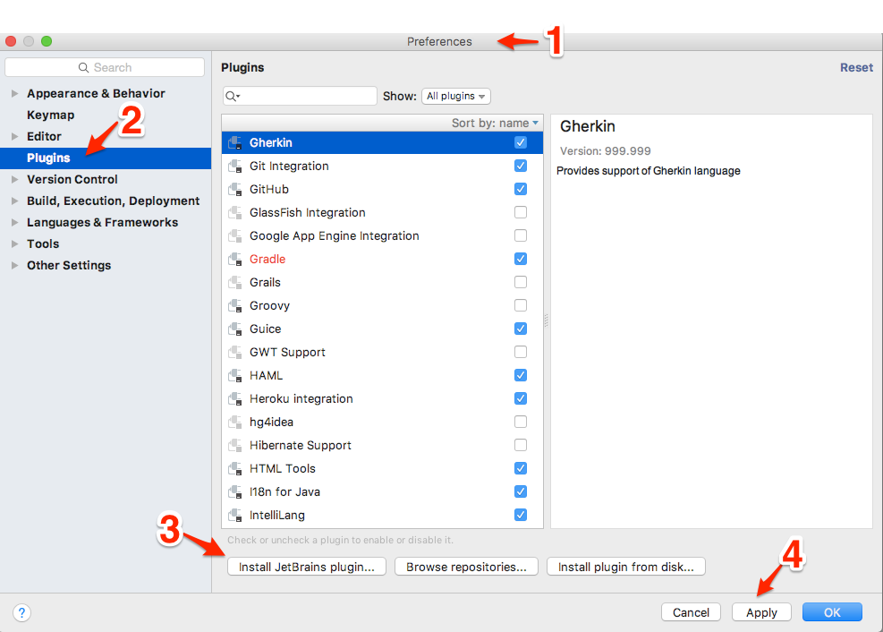
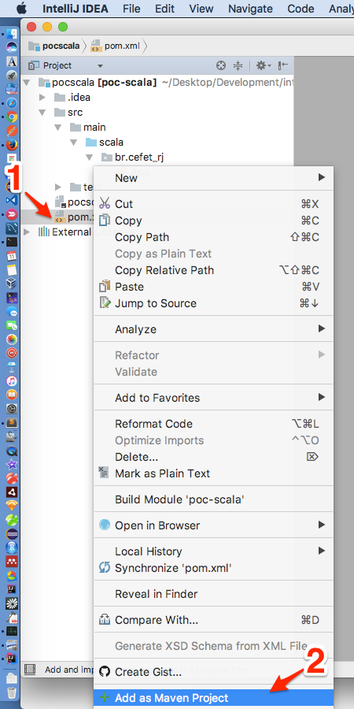
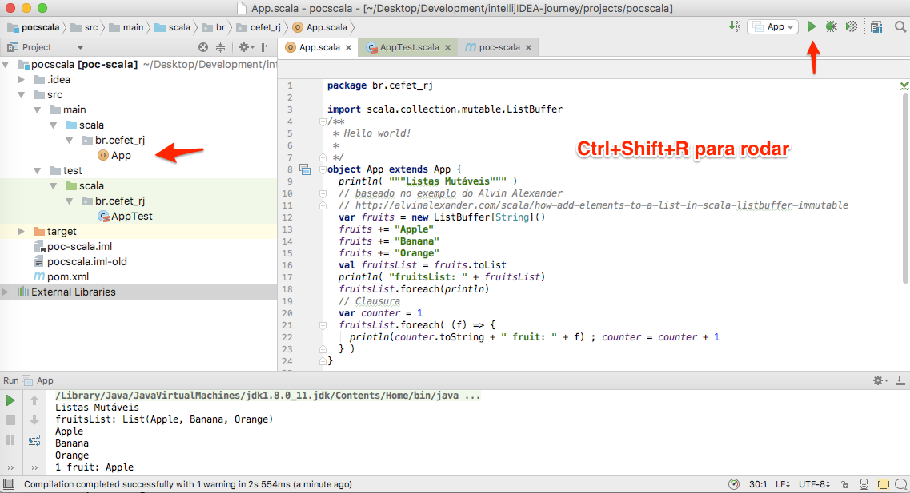
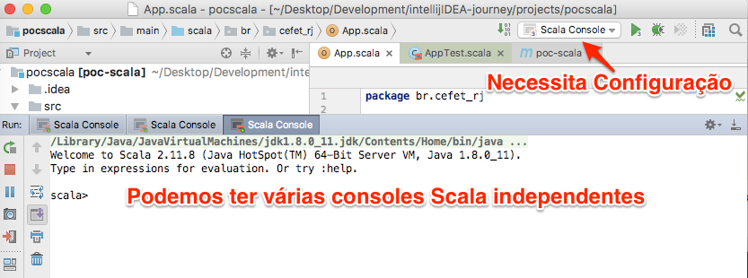
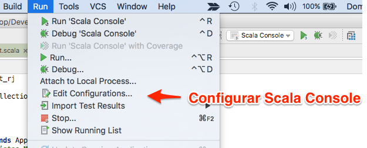

# intellij-journey

IntelliJ IDEA Ultimate da JetBrains

Licença para estudantes e professores pode ser obtida em [https://www.jetbrains.com/shop/eform/students](https://www.jetbrains.com/shop/eform/students)

Videos educativos oficiais e documentação em Geral - [https://www.jetbrains.com/idea/documentation/](https://www.jetbrains.com/idea/documentation/)

## Download para macOS

`wget https://download-cf.jetbrains.com/idea/ideaIU-2016.3.4.dmg` 

## Compilador Scala

No macOS o compilador Scala fica instalado em /usr/local/scala/bin

É bastante saudável criar a variável de ambiente **SCALA_HOME** como abaixo

```bash
export SCALA_HOME=/usr/local/scala
```

e atualizar a variavel **PATH**

```bash
export PATH=$SCALA_HOME:$PATH
```

ambas no arquivo `.bash_profile`


## Usando a IDE

### Customização 

A primeira coisa que aparece após a instalação é a **Customização**. Veja sequencia abaixo.






### Dicas diárias

As dicas são interessantes para ir aprendendo a usar a ferramenta aos poucos



### Menu principal

O Menu principal exibe dezenas de funcionalidades ao navegarmos por ele. Algumas se destacam



### Um projeto de exemplo

Uma visão geral do projeto poc-scala 




É necessário instalar o plugin Scala.



Encontre o plugin Scala e Instale. Ao final você deverá reiniciar a IDE


Partindo de projeto com POM é necessário fazer **add as maven project**. Veja imagem abaixo





Podemos executar a aplicação via atalho




Se desejar abrir consoles Scala na IDE como mostrado abaixo



Você deve configurar o Run



## Rodando Programa Scala com Shell Script

Veja arquivo `scala.sh` de exemplo 

```scala
scala.sh 
#!/usr/bin/env scala
object HelloWorld extends App {
  println("Hello, world!")
}
HelloWorld.main(args)
```

Ele deve ter o flag de execução habilitado


```bash
chmod a+rx scala.sh
```


# Build com Maven na console Bash

```bash
cd Development
git clone git@github.com:joao-parana/intellijIDEA-journey.git
cd intellijIDEA-journey
tail README.md 
cd projects/pocscala
mvn install
```

# Links

* [Coleções em Scala - https://twitter.github.io/scala_school/collections.html](https://twitter.github.io/scala_school/collections.html)
* [Aplicação Scala no IntelliJ IDEA - https://www.jetbrains.com/help/idea/2016.3/creating-and-running-your-scala-application.html](https://www.jetbrains.com/help/idea/2016.3/creating-and-running-your-scala-application.html)
* [Criação de UML via WEB - http://www.plantuml.com/plantuml](http://www.plantuml.com/plantuml)

